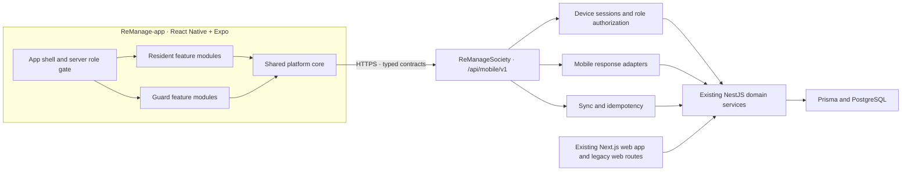

# ReManage Mobile App Design

**Date:** 2026-07-13

**Status:** Approved design; implementation has not started

**Mobile repository:** `C:\Users\pawan\Projects\ReManage-app`

**Existing web/backend repository:** `C:\Users\pawan\Projects\ReManageSociety`

## 1. Purpose

Build a completely separate React Native and Expo mobile application for ReManage. The existing ReManageSociety repository remains the web application and backend system. The mobile app does not copy the web frontend and does not call the backend's mixed legacy routes directly.

The first milestone serves two personas:

- Resident
- Guard

One role-aware app binary serves both personas. A verified server session determines the user's approved roles, active role, permissions, navigation, dashboard, data and workflows. The app never presents a combined Resident and Guard dashboard.

## 2. Goals

- Deliver a private, one-society beta on Android and iOS before any public-store launch.
- Give Resident and Guard users native, role-specific daily workflows.
- Preserve the existing ReManageSociety web application and backend business rules.
- Establish a dedicated, versioned and typed mobile API boundary.
- Support password login and login-only OTP for existing approved accounts.
- Use revocable, rotating, per-device native sessions.
- Support a narrowly controlled offline mode for essential Guard visitor actions.
- Deliver near-complete Resident website coverage in three gated waves.
- Make payment, notification, authorization and local-data behaviour explicit and auditable.

## 3. Non-goals for the first milestone

- Immediate public Play Store or App Store release
- Account registration through OTP
- Replacing the existing ReManageSociety web application or backend
- Calling legacy Next.js API routes directly from the mobile app
- A combined multi-role dashboard
- General-purpose offline operation
- Offline approval of unknown or sensitive visitors
- Guard blacklist management
- Advanced visitor ID or photo verification
- Automatic client-side confirmation that a UPI payment is paid
- Rebuilding browser Web Push as part of native push delivery

## 4. Delivery strategy

The beta uses the same private cohort throughout three feature waves. Each wave is enabled by society-level server controls and must pass its acceptance gate before the next wave starts.

### Wave 1: platform, essentials and complete Guard scope

Mobile platform:

- Expo app shell
- Password and OTP login
- Device sessions
- Role-aware navigation
- `/api/mobile/v1` client and contracts
- Native push registration
- Offline Guard queue
- Error handling and privacy-safe diagnostics

Resident:

- Dashboard/Home
- Visitors, invitations, approvals and history
- Bills and UPI payment submission
- Parcels
- Notices
- Complaints
- SOS

Guard:

- Gate and visitor entry/exit
- Parcels
- Notices
- SOS
- Incident reports
- Shift tracking
- Recently synchronized visitor approvals
- Offline visitor check-in and check-out queue

### Wave 2: services and community

- Amenities
- Events
- Community posts
- Parking
- Staff

### Wave 3: governance and lifecycle workflows

- Polls
- Documents
- NOC
- Move-in and move-out

## 5. System architecture

The selected architecture is a feature-first modular Expo application with a shared platform core and a dedicated NestJS mobile API module inside the existing backend.



### Architectural rules

- The mobile app communicates only through `/api/mobile/v1`.
- Existing web users continue through the existing web application and browser-session paths.
- Mobile controllers and adapters reuse existing backend domain services instead of duplicating business rules.
- When a mobile-required rule exists only inside a legacy Next.js route, that rule is extracted into a shared backend domain service used by both the web adapter and the mobile controller. The mobile module neither calls the legacy route internally nor copies its logic.
- Every mobile request is authenticated, society-scoped, role-checked and auditable.
- Resident and Guard feature modules are isolated from one another.
- Shared mobile modules contain platform capabilities and UI primitives, not role-specific business rules.
- The OpenAPI description of `/api/mobile/v1` is the contract source of truth for the generated mobile client.

## 6. Mobile component boundaries

### 6.1 App shell

Responsibilities:

- Start the application
- Restore or renew a valid device session
- Load the server bootstrap payload
- Activate exactly one approved role
- Mount the correct role navigation tree
- Handle global loading, update-required, signed-out and fatal-error states

The app shell contains no Resident or Guard business logic.

### 6.2 Authentication and session module

Responsibilities:

- Password login
- OTP challenge request and verification
- Secure renewable-credential storage
- Access-credential renewal
- Device-session revocation
- Logout and local-data purge
- Server-approved role switching

The access credential is short-lived and kept in memory whenever possible. The renewable credential is device-specific, stored using operating-system protected storage, hashed on the server, rotated on every successful renewal and revocable independently for each device.

### 6.3 Typed API client

Responsibilities:

- Use generated `/api/mobile/v1` request and response types
- Attach the bearer access credential
- Attach app version, platform and request ID metadata
- Attach idempotency keys to retryable mutations
- Normalize transport and server errors
- Prevent raw network calls from feature modules

Feature modules must not call `fetch`, Axios or legacy routes directly.

### 6.4 Role-scoped data and offline sync

Responsibilities:

- Cache server data by society, user and active role
- Store only the minimum fields needed for approved offline Guard work
- Maintain the Guard action queue
- Enforce the 24-hour offline-data expiry
- Synchronize safely after reconnection
- Expose Pending, Syncing, Synced and Rejected states
- Purge affected data after logout, device revocation or role removal

If the persistence layer does not provide suitable encryption at rest in the selected Expo runtime, sensitive cached payload fields must be application-encrypted using a key held in operating-system protected storage.

### 6.5 Native push and deep links

Responsibilities:

- Register and rotate Expo push tokens per device session
- Apply the user's configurable notification preferences
- Preserve the mandatory critical-notification policy inside the app
- Route taps only after revalidating the current session and role permission
- Fall back to the active role dashboard for expired, deleted or unauthorized targets

### 6.6 Design system

Responsibilities:

- Shared accessible components
- ReManage typography and spacing
- Warm Resident visual tokens
- High-contrast Guard visual tokens
- Loading, empty, stale, offline, error and success patterns
- Screen-reader, dynamic-text, contrast, touch-target and reduced-motion support

### 6.7 Feature modules

Each feature module owns its screens, role-specific view models, server queries, mutations and navigation entries. Feature modules consume only public platform interfaces and generated API contracts.

Resident and Guard modules cannot import one another. Reusable visual components may move into the design system only when they do not contain role permission or business logic.

## 7. Backend mobile API boundary

### 7.1 Base contract

- Base path: `/api/mobile/v1`
- Transport: JSON over HTTPS
- Authentication: bearer access credential
- Contract source: OpenAPI generated from the NestJS mobile module
- Breaking changes: require a new API major version
- Compatible additions: remain within `v1`
- Request tracing: every request carries or receives a request ID
- Mutation retry safety: retryable mutations require an idempotency key

The server may reject an incompatible app version with an `APP_VERSION_UNSUPPORTED` error and a safe update message. It must never silently return a response shape the installed app cannot interpret.

### 7.2 Authentication and session endpoints

| Method | Path | Purpose |
| --- | --- | --- |
| `POST` | `/api/mobile/v1/auth/password` | Authenticate an existing approved account with identifier and password |
| `POST` | `/api/mobile/v1/auth/otp/request` | Create a short-lived login challenge for an existing approved account |
| `POST` | `/api/mobile/v1/auth/otp/verify` | Verify the challenge and create a device session |
| `POST` | `/api/mobile/v1/session/refresh` | Rotate the renewable credential and issue a new access credential |
| `GET` | `/api/mobile/v1/session/bootstrap` | Return user, society, roles, active role, permissions, feature flags and notification policy |
| `PUT` | `/api/mobile/v1/session/active-role` | Switch to another server-approved role and audit the change |
| `POST` | `/api/mobile/v1/session/logout` | Revoke the current device session |

OTP is login-only. The request endpoint returns a generic response whether or not an identifier exists, preventing account enumeration. Challenges are short-lived, single-use, attempt-limited and rate-limited by account identifier, installation and network source. OTP values are never written to logs.

The server bootstrap payload is the authority for role navigation. Client-stored role choices never grant access.

### 7.3 Session response

A successful password or OTP login returns:

- Short-lived access credential and expiry
- Rotating renewable credential and expiry
- Device-session ID
- User ID and display name
- Society ID and society name
- Approved roles
- Active role
- Effective permission identifiers
- Society-level mobile feature flags
- Notification-policy summary

The client installation ID is a random application identifier, not a hardware fingerprint.

### 7.4 Role and feature endpoint families

- `/api/mobile/v1/resident/*` contains Resident read models and mutations.
- `/api/mobile/v1/guard/*` contains Guard read models and mutations.
- `POST /api/mobile/v1/guard/sync-actions` processes the approved offline action batch.
- `PUT /api/mobile/v1/devices/push-token` registers or rotates the current device token.
- `DELETE /api/mobile/v1/devices/push-token` removes the current token.
- `GET /api/mobile/v1/notification-preferences` reads configurable preferences.
- `PUT /api/mobile/v1/notification-preferences` changes only configurable preferences.
- `POST /api/mobile/v1/resident/bills/{billId}/utr` submits a UTR as Pending verification.

The mobile API may expose aggregate dashboard responses to reduce round trips, but those responses must be assembled through existing domain services and permission checks.

### 7.5 Error contract

Non-success responses use one stable envelope:

```json
{
  "error": {
    "code": "STABLE_MACHINE_CODE",
    "message": "Safe user-facing message",
    "requestId": "traceable-request-id",
    "retryable": false,
    "fieldErrors": {}
  }
}
```

`fieldErrors` is present only for validation failures. Internal exceptions, credentials, OTP values and sensitive database details are never exposed.

## 8. Required backend records

The existing backend requires explicit records or equivalent persisted capabilities for:

- Device sessions, including user, society, installation, platform, app version, hashed renewable credential, rotation chain, last seen, expiry and revocation
- OTP login challenges or provider references, including expiry, attempt count and single-use state
- Native Expo push tokens associated with a device session
- Mobile idempotency outcomes for retryable mutations
- Audited role-switch events
- Payment submissions with `PENDING_VERIFICATION`, `PAID` and `REJECTED` states
- Treasurer verification identity and timestamp
- Configurable notification preferences

The implementation may reuse an existing compatible record instead of adding a new table, but the behaviour and auditability above are mandatory.

## 9. Authentication, role and cache behaviour

### Cold start

1. Load the renewable credential from protected storage.
2. Renew the session if necessary.
3. Request `/session/bootstrap`.
4. Validate society membership, approved roles and active role.
5. Mount only the active role's navigation and data providers.

### Role switch

1. The user selects another role returned by the server.
2. The app requests `/session/active-role`.
3. The server verifies and audits the switch.
4. The app seals the prior role's cache and pending queue.
5. The app clears active queries, navigation history and view state.
6. The app mounts the new role shell and loads fresh permissions and data.

Role switching never merges Resident and Guard data. A pending Guard queue remains role-scoped and cannot be viewed from Resident mode.

### Logout and revocation

The app attempts to synchronize pending Guard actions before a user-requested logout. If actions remain while offline, it displays an irreversible-discard warning before allowing logout. An online logout revokes the server device session before purging credentials, cached data, notification tokens and queues. An explicitly confirmed offline logout purges all local credentials and data immediately; because the server is unreachable, its device-session record remains until natural expiry or remote revocation from the web or another authorized device.

Device revocation, society removal or role removal purges affected local data as soon as the app learns of the change. Revocation does not preserve an offline queue.

## 10. Offline Guard design

Offline support is deliberately narrow.

### Available offline

- View recently synchronized, already approved visitor records
- Record visitor check-in for a cached approval
- Record visitor check-out for a cached entry
- View queued action state

### Always online

- Unknown visitor decisions
- Expired or missing approvals
- Sensitive approval changes
- Incident submission
- Shift changes
- Parcel mutations
- SOS delivery confirmation
- Every action type not explicitly listed as offline-capable

### Queue item contract

Each queued action includes:

- Client action ID
- Idempotency key
- Society ID
- Guard user ID
- Active role
- Action type: visitor check-in or visitor check-out
- Target approval or visit ID
- Device occurrence time
- Queue creation time
- Sync state

The server revalidates the device session, society, role, permission, approval freshness and target state during synchronization. It stores the idempotency outcome so retries cannot create duplicate entries. Accepted records use server audit timestamps while retaining the device occurrence time as context.

Cached approval data expires after 24 hours. Expired data is deleted automatically and cannot authorize an action.

## 11. Navigation and visual design

### Resident

Bottom navigation:

- Home
- Visitors
- Bills
- More

The Resident dashboard prioritizes visitor approvals, bill status, parcels, complaints, notices and SOS.

### Guard

Bottom navigation:

- Gate
- Parcels
- Incidents
- More

The Guard dashboard prioritizes gate state, expected visitors, quick visitor logging, parcel handling, shift state, offline queue status and SOS readiness.

### Shared role behaviour

- The header shows the active role and society context.
- The role switch appears only for users with more than one server-approved role.
- Single-role users enter their role directly.
- The back stack cannot cross role boundaries.
- Permission removal redirects to a safe active-role destination.

### Visual direction

The app adapts the existing ReManage identity:

- Resident: warm cream, orange, yellow and charcoal
- Guard: high-contrast charcoal, orange and yellow
- Shared typography and component language
- Colour is never the only indicator of state

## 12. Native notifications

Native Expo Push is separate from the existing browser Web Push implementation.

### Critical

Examples: SOS and security emergencies.

- No in-app disable switch
- Operating-system settings may still block delivery
- The app shows push-permission health and retains an in-app notification record

### Transactional

Examples: visitors, parcels, payments, complaints, incidents and shifts.

- Enabled by default
- Configurable by the user

### Community

Examples: events, polls, community posts and general notices.

- Optional
- Configurable by the user

Every notification deep link revalidates the session, active role and permission before opening content.

## 13. UPI payment workflow

1. The Resident opens a bill and launches an installed UPI app.
2. ReManage passes the intended payee, amount and supported payment metadata.
3. The Resident returns to ReManage and submits the UTR.
4. The backend records a payment submission as `PENDING_VERIFICATION`.
5. A Treasurer reviews the UTR through the existing web system.
6. The Treasurer marks the submission `PAID` or `REJECTED` with an audit trail.
7. Only a verified `PAID` result updates the bill and issues a receipt.
8. The Resident receives the status through refresh and, when allowed, native push.

The mobile client can never mark a bill paid. Duplicate or invalid UTR submissions return a conflict or validation error. A rejected submission may be replaced with a new valid UTR.

The existing web payment-confirmation path must be hardened at the same backend boundary: submitting a UTR creates or updates a Pending verification record and cannot directly create a Paid ledger entry. This prevents the web path from bypassing the mobile payment rule.

## 14. Critical data flows

### Online mutation

1. A role feature starts an action.
2. The typed client attaches credentials, version, request ID and idempotency key when required.
3. `/api/mobile/v1` verifies the device session, society, role and permission.
4. An existing domain service applies the business rule in a database transaction.
5. The mobile adapter returns a stable response and audit reference.

### Offline Guard synchronization

1. A Guard uses an unexpired cached approval.
2. The app records a local check-in or check-out with an idempotency key.
3. The queue displays Pending.
4. Reconnection starts synchronization.
5. The server accepts or rejects after complete revalidation.
6. The client displays Synced or a specific Rejected reason.

### Push deep link

1. A backend event is classified by notification tier.
2. Native push is sent through the registered Expo token.
3. The user taps the notification.
4. The app restores and validates the current session.
5. The app opens an authorized destination or the active role dashboard.

## 15. Error handling and recovery

- The client maps stable API error codes to clear, actionable messages.
- An expired access credential triggers one renewal attempt, not a renewal loop.
- A failed renewable credential signs the user out and purges local data.
- Cached screens visibly identify stale or offline data.
- Reads may retry automatically with bounded backoff.
- Writes retry only when protected by idempotency.
- Offline queue items expose Pending, Syncing, Synced and Rejected states.
- Approval expiry and state conflicts are rejected rather than silently overridden.
- Cancelled UPI handoffs and invalid or duplicate UTRs never change a bill to Paid.
- SOS displays Sent only after server acknowledgement; otherwise it exposes an emergency-contact fallback.
- Unauthorized, deleted or expired push destinations open a safe role dashboard.
- Fatal errors show a recovery action and a request ID when one exists.

## 16. Privacy and diagnostics

Crash, performance and operational telemetry must be enabled before the live-data beta. Telemetry may include:

- App version and platform
- Device-session ID represented by a non-secret internal identifier
- Active role identifier
- Feature or screen identifier
- Request ID
- Error code
- Queue state and retry count
- Crash and performance measurements

Telemetry must not include:

- Passwords
- OTP values
- Access or renewable credentials
- Full names, phone numbers or visitor identity
- UTR values
- Complaint, incident or SOS narrative content
- Documents or images

The exact telemetry provider is an implementation choice, but these collection and redaction rules are part of the product contract.

## 17. Testing strategy

### Contract tests

- Generated mobile client matches `/api/mobile/v1` OpenAPI
- Breaking response changes fail validation
- Mobile code has no direct legacy-route dependency
- Error envelopes and idempotency requirements remain stable

### Unit tests

- Session restoration, rotation and revocation
- Role selection and cache namespacing
- Notification-tier decisions
- UPI payment-state transitions
- Offline queue transitions and expiry
- Error mapping

### Backend integration tests

- Password login
- OTP request and verification
- OTP enumeration protection and rate limits
- Renewable-credential rotation and reuse rejection
- Device revocation
- Society and role isolation
- Role switching and auditing
- Idempotent Guard synchronization
- Treasurer payment verification
- Native token registration and preference enforcement

### Navigation and component tests

- Resident cannot mount Guard screens
- Guard cannot mount Resident screens
- Single-role and multi-role startup
- Role-switch back-stack reset
- Permission-safe push deep links
- Loading, empty, stale, offline, error and success states

### Real-device end-to-end tests

Android and iOS tests cover:

- Resident visitor approval
- Resident UPI handoff and UTR submission
- Resident parcels, complaints and SOS
- Guard visitor entry and exit
- Guard parcel handling
- Guard incident reporting
- Guard shift tracking
- Guard SOS
- Multi-role switching
- Airplane mode, app termination, reconnection and duplicate retries
- 24-hour cache expiry

### Accessibility and security checks

- Screen-reader labels
- Dynamic text sizing
- Contrast
- Touch targets
- Reduced motion
- OTP abuse controls
- Tenant isolation
- Secure credential storage
- Sensitive-log redaction
- Revoked-device behaviour
- Malicious and cross-role deep links

## 18. Beta environments and distribution

### Stage 1: isolated test environment

- Separate test server and test data
- Same API contract and migration shape as live
- No production Resident, Guard, visitor or payment data
- Each wave completes automated and real-device acceptance here first

### Stage 2: live-data controlled beta

- Same private cohort
- One society
- Approximately 30–50 Residents
- Approximately 5–10 Guards
- Four-week observation period
- EAS Internal Distribution for Android
- TestFlight for iOS

No public-store release occurs during this milestone.

## 19. Beta graduation gate

The beta graduates only when all conditions are true:

- At least 99.5% crash-free sessions
- At least 95% success across defined critical Resident and Guard workflows
- Offline Guard actions synchronize reliably after reconnection
- No unresolved critical security defect
- No unresolved critical data-loss defect
- All three waves have passed their test and live acceptance gates
- Society management gives final approval

Public Play Store and App Store planning begins only after graduation.

Critical-workflow success is measured as privacy-safe completed attempts divided by started attempts for the end-to-end workflows listed in this document. Explicit user cancellations are recorded separately and excluded; technical failures, permission failures caused by defects and abandoned attempts after an app or server error count as unsuccessful.

## 20. Key risks and mitigations

| Risk | Mitigation |
| --- | --- |
| Mixed legacy backend routes create unstable mobile behaviour | Dedicated NestJS `/api/mobile/v1`, OpenAPI contracts and generated client |
| Resident and Guard permissions leak across roles | Separate feature modules, separate navigation trees and server authorization on every request |
| Offline retries create duplicate gate records | Idempotency keys, persisted outcomes and server-side revalidation |
| Stale approvals authorize invalid entry | 24-hour maximum cache, approval expiry checks and online-only unknown visitors |
| UPI submission is treated as proof of payment | Mandatory Pending verification state and Treasurer-only confirmation |
| Native and browser push implementations conflict | Separate native device-token registry and unchanged browser Web Push path |
| Broad Resident scope delays the beta | Three gated waves for the same private cohort |
| Sensitive information remains on a lost or revoked device | Minimized role-scoped cache, protected encryption key and immediate purge on revocation |
| Test behaviour differs from live | Identical API contracts, migration shape and release checks across both environments |

## 21. Design acceptance criteria

The implementation plan must preserve all of the following:

- A separate Expo application in ReManage-app
- The existing ReManageSociety web/backend system remains in place
- One server-controlled role-aware binary
- Dedicated `/api/mobile/v1` boundary
- Password and login-only OTP for existing approved accounts
- Rotating and revocable per-device sessions
- Role-isolated navigation, data and offline queues
- Resident and Guard scope delivered in the three approved waves
- Offline Guard support limited to cached approvals and visitor check-in/check-out
- 24-hour offline-data expiry and immediate purge on revocation
- Pending Treasurer verification for UPI submissions
- Native Expo Push with the approved three-tier policy
- Approved navigation and adaptive ReManage visual direction
- Isolated test environment before live data
- Four-week one-society beta and the approved graduation gate

Implementation planning must decompose this program into ordered, reviewable phases: backend mobile foundation, shared mobile platform, Wave 1 Resident, complete Guard scope, Wave 2, Wave 3 and beta hardening. No phase may bypass the acceptance gate of the phase it depends on.

This document authorizes implementation planning only after the user reviews and approves the written specification. It does not authorize scaffolding or implementation by itself.
